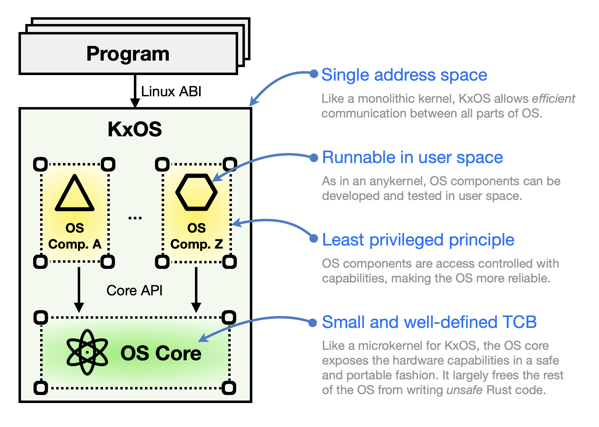

# Jinux

Jinux is a modern and secure OS kernel written in Rust, especially suitable for Trusted Execution Environments (TEEs)

## Design Goals

**1. Security by design.** Security is our top priority in the design of Jinux. As such, we adopt the widely acknowledged security best practice of [least privilege principle](https://en.wikipedia.org/wiki/Principle_of_least_privilege) and enforce it in a fashion that leverages the full strengths of Rust. To do so, we partition Jinux into two halves: a _privileged_ OS core and _unprivileged_ OS components. As a result, we can write the OS components almost entirely in _safe_ Rust, while taking extra cautions with the _unsafe_ Rust code in the OS core. Furthermore, we propose the idea of _everything-is-a-capability_, which elevates the status of [capabilities](https://en.wikipedia.org/wiki/Capability-based_security) to the level of a ubiquitous security primitive used throughout the OS. We make novel use of Rust's advanced features (e.g., [type-level programming](https://willcrichton.net/notes/type-level-programming/)) to make capabilities more accessible and efficient. The net result is improved security and uncompromised performance.

**2. Trustworthy OS-level virtualization.** OS-level virtualization mechanisms (like Linux's cgroups and namespaces) enable containers, a more lightweight and arguably more popular alternative to virtual machines (VMs). But there is one problem with containers: they are not as secure as VMs (see [StackExchange](https://security.stackexchange.com/questions/169642/what-makes-docker-more-secure-than-vms-or-bare-metal), [LWN](https://lwn.net/Articles/796700/), and [AWS](https://docs.aws.amazon.com/AmazonECS/latest/bestpracticesguide/security-tasks-containers.html)). There is a real risk that malicious containers may exploit privilege escalation bugs in the OS kernel to attack the host. [A study](https://dl.acm.org/doi/10.1145/3274694.3274720) found that 11 out of 88 kernel exploits are effective in breaking the container sandbox. The seemingly inherent insecurity of OS kernels leads to a new breed of container implementations (e.g., [Kata](https://katacontainers.io/) and [gVisor](https://gvisor.dev/)) that are based on VMs, instead of kernels, for isolation and sandboxing. We argue that this unfortunate retreat from OS-level virtualization to VM-based one is unwarranted---if the OS kernels are secure enough. And this is exactly what we plan to achieve with Jinux. We aim to provide a trustworthy OS-level virtualization mechanism on Jinux.

**3. High-velocity development.** Traditional OS kernels like Linux are hard to develop, test, and debug. Kernel development involves countless rounds of programming, failing, and rebooting on bare-metal or virtual machines. This way of life is unproductive and painful. Such a pain point is also recognized and partially addressed by [research work](https://www.usenix.org/conference/fast21/presentation/miller), but we think we can do more. In this spirit, we design the OS core to provide high-level APIs that are largely independent of the underlying hardware and implement it with two targets: one target is as part of a regular OS in kernel space and the other is as a library OS in user space. This way, all the OS components of Jinux, which are stacked above the OS core, can be developed, tested, and debugged in user space, which is more friendly to developers than kernel space.

**4. High-fidelity Linux ABI.** An OS without usable applications is useless. So we believe it is important for Jinux to fit in an established and thriving ecosystem of software, such as the one around Linux. This is why we conclude that Jinux should aim at implementing high-fidelity Linux ABI, including the system calls, the proc file system, etc. 

## Architecture

Here is an overview of the architecture of Jinux.



## Roadmap

While there is nothing revolutionary in Jinux, it does explore some new design points in constructing secure Rust OSes. To minimize the risks of the project, we plan to move towards Minimal Viable Product (MVP) in iterations.

- [ ] Iteration 1: Build a minimal OS core runnable in both VMs and user space.
- [ ] Iteration 2: Build a minimal set of OS components to run simple programs
- [ ] Iteration 3: Add the compile-time access control mechanism
- [ ] Iteration 4: Add more system calls to support busybox
- [ ] Iteration 5: Add a minimal set of OS-level virtualization functionalities
- [ ] More iterations...

## How to build and test

While most code is written in Rust, the project-scope build process is governed 
by Makefile.

Before downloading source code, install and init Git LFS since the project manage binaries with Git LFS.
```bash
# 1. install git-lfs
brew install git-lfs            # for mac
apt install git-lfs             # for ubuntu

# 2. init git-lfs for current user
git lfs install --skip-repo     # for mac & ubuntu
```

Then, download source codes as normal.
```bash
git clone [repository url]
```

After downloading the source code, run the following command once to make sure
all developmennt tools are installed.
```bash
make setup
```

Then, install some standalone tools (e.g., `cargo-component`) under the project directory.
``` bash
make tools
```

Set environmental variables to enable `cargo` find installed tools.
```bash
export PATH=`pwd`/src/target/bin:${PATH}
```

Then, we can build and test the project.
```bash
make
```

If everything goes well, then we can run the OS.
```bash
make run
```
