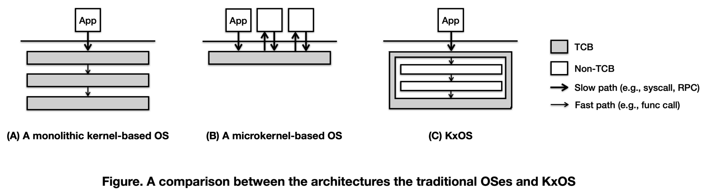

# Jinux

Jinux is a _secure_, _fast_, and _general-purpose_ OS kernel, written in Rust and providing Linux-compatible ABI.

Jinux is designed and implemented with an emphasis on security, rendering it highly attractive for usage scenarios where Linux ABI is indispensable, but Linux itself is deemed insecure given its sheer size of TCB and its nature of being memory unsafe. An instance of such usage is employing Jinux as the guest OS for VM TEEs (e.g., [AMD SEV](https://www.amd.com/en/developer/sev.html) and [Intel TDX](https://www.intel.com/content/www/us/en/developer/articles/technical/intel-trust-domain-extensions.html)).

## What's unique about Jinux

Jinux is a _zero-cost_, _least-privilege_ OS kernel. A least-privilege OS is one that adheres to the principle of least privileges, which mandates that every unit (e.g., a subsystem, a module, a function, or even an object) of the OS has the minimum authority and permissions required to perform its tasks. This approach reduces the security risk associated with any single element's bugs or flaws. By "zero-cost", we means the same as in Rust's philosophy of zero-cost abstractions, which emphasizes that high-level abstractions (like those that enable least privilege principles) should be available to developers to use, but not come at the cost of performance. Thus, a zero-cost, least-privilege OS enhances its security without compromising its performance.

Some prior OSes do abide by the [principle of least privilege](https://en.wikipedia.org/wiki/Principle_of_least_privilege), but come with considerable performance costs. Take [seL4](https://sel4.systems/) as an example. A [seL4-based multi-server OS](https://docs.sel4.systems/projects/camkes/) minimizes the scope of the OS running in the privileged CPU mode to the seL4 microkernel. The bulk of OS functionalities are implemented by process-based servers, which are separated by process boundary and only allowed to communicate with each other through well-defined interfaces, usually based on RPC. Each service can only access kernel resources represented by [seL4 capabilities](), each of which is restricted with respect to its scope and permissions. All these security measures contribute to the enhanced security of the OS, but result in a considerable runtime costs due to context switching, message passing, and runtime checks.

Jinux is unique in practicing the principle of least privilege without sacrificing the performance. This is achieved by realizing the full potential of Rust, which, compared to the traditional system programming language like C/C++, offers unique features like an expressive type system, memory safety with unsafe extensions, powerful macros, and a customizable toolchain. By leveraging these unique features, Jinux is able to construct zero-cost abstractions that enable least privileges at the following three levels.

1. The architectural level. Jinux is architected as a _framekernel_, where the entire OS resides in a single address space and unsafe Rust code is restricted to a tiny portion of the OS called Jinux Framework. The Framework exposes safe APIs to the rest of Jinux, which implements the most of OS functionalities in safe Rust code completely. Thanks to the framekernel architecture, Jinux's TCB for memory safety is minimized.



2. The component level. Upon Jinux Framework is a set of OS components, each of which is responsible for a particular OS functionality, feature, or device. These OS components are Rust crates with two traits: (1) containing safe Rust code, as demanded by the framekernel architecture, and (2) being governed by Jinux Component System, which can enforce a fine-grained access control to their public APIs. The access control policy is specified in a configuration file and enforced at compile time, using a static analysis tool.

3. The object level. Jinux promotes the philosophy of _everything-is-a-capability_, which means all kernel resources, from files to threads, from virtual memory to physical pages, should be accessed through [capabilities](https://en.wikipedia.org/wiki/Capability-based_security). In Jinux, capabilities are implemented as Rust objects that are constrained in their creation, acquisition, and usage. One common form of capabilities is those with access rights. Wherever possible, access rights are encoded in types (rather than values) so that they can be checked at compile time, eliminating any runtime costs.

As a zero-cost, least-privilege OS, Jinux provides the best of both worlds: the performance of a monolithic kernel and the security of a microkernel. Like a monolithic kernel, the different parts of Jinux can communicate with the most efficient means, e.g., function calls and memory sharing. In the same spirit as a microkernel, the fundamental security properties of the OS depend on a minimum amount of code (i.e., Jinux Framework).

## Build and test

While most of the code is written in Rust, the project-scope build process is governed by Makefile. The development environment is managed with Docker. Please ensure Docker is installed and can be run without sudo privilege.

### Preparation
1. Download the latest source code of jinux.
```bash
git clone [repository url]
```

2. After downloading the source code, run the following command to pull the development image.
```bash
docker pull jinuxdev/jinux:0.1.0
```

3. Start the development container.
```bash
docker run -it --privileged --network=host --device=/dev/kvm -v `pwd`:/root/jinux jinuxdev/jinux:0.1.0
```

**All build and test commands should be run inside the development container.**

### Build

1. Build the project.
```bash
make build
```

2. If everything goes well, then we can run the OS.
```bash
make run
```

### Test  

We can run unit tests and integration tests if building succeeds.
```bash
make test
```

If we want to check access control policy among components, install some standalone tools (e.g., `cargo-component`).
``` bash
make tools
```

Then we can use the tool to check access control policy.
```bash
cargo component-check
```

### Syscall Test

This command will build the syscall test binary and automatically run Jinux with the tests using QEMU.
```bash
make run AUTO_SYSCALL_TEST=1
```

Alternatively, if you wish to test it interactively inside a shell in Jinux.
```bash
make run BUILD_SYSCALL_TEST=1
```

Then, we can run the following script using the Jinux shell to run all syscall test cases.
```bash
/opt/syscall_test/run_syscall_test.sh
```

## Code organization

The codebase of Jinux is organized as below.

* `build/`: creating a bootable Jinux kernel image along with an initramfs image. It also supports `cargo run` since it is the only package with `main()`.
* `kernel/`: defining the entry point of the Jinux kernel.
* `framework/`: the privileged half of Jinux (allowed to use `unsafe` keyword)
    * `jinux-frame`: providing the safe Rust abstractions for low-level resources like CPU, memory, interrupts, etc;
    * `libs`: Privileged libraries.
* `services/`: the unprivileged half of Jinux (not allowed to use `unsafe` directly), implementing most of the OS functionalities.
    * `comps/`: Jinux OS components;
    * `libs/`: Jinux OS libraries;
        * `jinux-std`: this is where system calls are implemented. Currently, this crate is too big. It will eventually be decomposed into smaller crates.
* `tests/`: providing integration tests written in Rust.
* `regression/`: providing user-space tests written in C.
* `docs/`: The Jinux book (needs a major update).

## Development status

Jinux is under active development. The list below summarizes the progress of important planned features.

* Technical novelty
    - [X] Jinux Framework
    - [X] Jinux Component System
    - [X] Jinux Capabilities
* High-level stuff
    * Process management
        - [X] Essential system calls (fork, execve, etc.)
        * Supported file formats:
            - [X] ELF
            - [X] Scripts (Shebang)
        - [X] Process group
        - [ ] Process credentials
    * Thread management
        - [X] Essential system calls (clone, futex, etc.)
    * Scheduling
        - [X] Essential system calls (yield, nanosleep, etc.)
        * Sleeping
        * Schedulers
            - [ ] Scheduler framework
            - [X] Round-robin scheduler
        - [ ] Preemption
    * Memory management
        - [X] Essential system calls (mmap, munmap, etc.)
        * Mapping types
            - [X] Anonymous
            - [X] File-backed
        * Optimizations
            - [X] On-demand paging
            - [X] Copy-on-write
    * File system
        * Essential system calls 
            - [X] File I/O (read, write, etc.)
            - [X] FS operations (create, unlink, etc.)
        * VFS
            - [X] The VFS framework
            - [X] Dentry cache
            - [X] Page cache
        * File systems
            - [X] Ramfs
            - [X] Initramfs
            - [X] Procfs
            - [ ] Ext2/3/4
    * Inter-process communication
        * POSIX signals
            - [X] Essential system calls (sigaction, sigreturn, kill, etc.)
        - [ ] Pipe
    * Network I/O
        * I/O multiplexing
            - [ ] poll
            - [ ] select
            - [ ] epoll
        * Socket types
            - [ ] TCP sockets
            - [ ] Unix sockets
            - [ ] UDP sockets
    * Time and clocks

* Low-level stuff
    * Devices
        - [X] PCI
        - [X] System time 
        - [X] Tty
        - [X] Virtio-blk
        - [ ] Virtio-net
        - [ ] Device abstraction layer
    * CPU archs
        - [X] x86-64
            - [ ] AMD SEV
            - [ ] Intel TDX
        - [ ] Arm
        - [ ] RISC-V
    * Misc
        - [ ] Multi-core support
        - [ ] User-mode development
