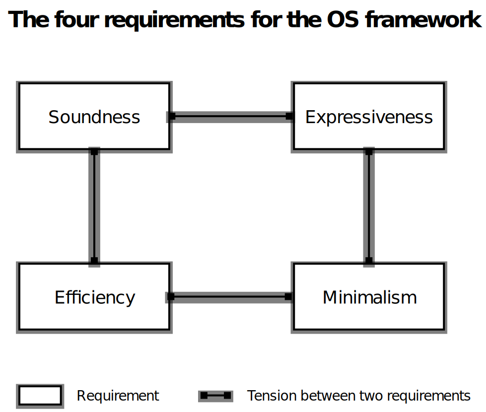

# The Framekernel Architecture

## Framekernel: What and Why

> The security of a microkernel, the speed of a monolithic kernel.

Asterinas introduces a novel OS architecture called _framekernel_,
which unleashes the full power of Rust
to bring the best of both monolithic kernels and microkernels.

Within the framekernel architecture,
the entire OS resides in the same address space (like a monolithic kernel)
and is required to be written in Rust.
However, there's a twist---the kernel is partitioned in two halves:
the OS Framework (akin to a microkernel)
and the OS Services.
Only the OS Framework is allowed to use _unsafe Rust_,
while the OS Services must be written exclusively in _safe Rust_.

|              | Unsafe Rust | Responsibilities                                                               | Code Sizes |
|--------------|-------------|--------------------------------------------------------------------------------|------------|
| OS Framework | Allowed     | Encapsulate low-level unsafe code within high-level safe APIs                  | Small      |
| OS Services  | Not allowed | Implement OS functionalities, e.g., system calls, file systems, device drivers | Large      |

As a result,
the memory safety of the kernel can be reduced to that of the OS Framework,
thus minimizing the Trusted Computing Base (TCB)
associated with the kernel's memory safety.
On the other hand,
the single address space allows different parts of the kernel
to communicate in the most efficient means,
e.g., function calls and shared memory.
Thanks to the framekernel architecture,
Asterinas can offer both exceptional performance and enhanced safety.

## Requirements for the OS Framework

While the concept of framekernel is straightforward,
the design and implementation of the required OS framework present challenges.
It must concurrently fulfill four criteria.

* **Soundness.**
The safe APIs of the framework are considered sound
if no [undefined behaviors](https://doc.rust-lang.org/reference/behavior-considered-undefined.html#behavior-considered-undefined) shall be triggered
by whatever safe Rust code that a programmer may write using the APIs
- as long as the code is verified by the Rust toolchain.
Soundness ensures that the OS framework,
in conjunction with the Rust toolchain,
bears the full responsibility for the kernel's memory safety.

* **Expressiveness.**
The framework should empower developers
to implement a substantial range of OS functionalities
in safe Rust using the APIs.
It is especially important that
the framework enables writing device drivers in safe Rust,
considering that device drivers comprise the bulk of the code
in a fully-fleged OS kernel (like Linux).

* **Minimalism.**
As the TCB for memory safety,
the framework should be kept as small as possible.
No functionality should be implemented inside the framework
if doing it outside is possible.

* **Efficiency.**
The safe API provided by the framework is only allowed
to introduce minimal overheads.
Ideally, these APIs should be realized
as [zero-cost abstractions](https://monomorph.is/posts/zero-cost-abstractions/).

Fortunately, our efforts
to design and implement an OS framework meeting these standards
have borne fruit in the form of the [Asterinas OSTD](../ostd/).
Using this framework as a foundation,
we have developed the Asterinas Kernel;
this framework also enables others to create their own framekernels,
with different goals and tradeoffs.
