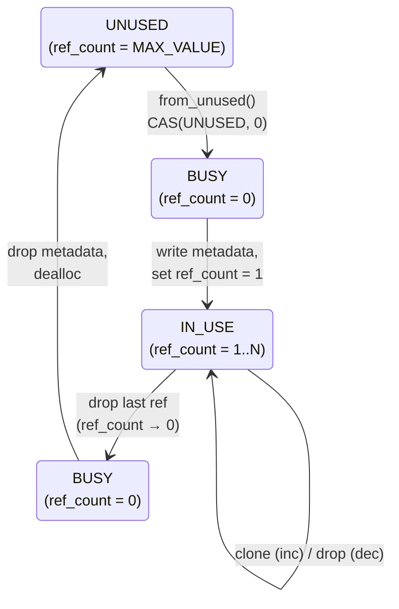

# Safe Physical Memory Management

The typed/untyped memory model is the cornerstone of OSTD's soundness.
It addresses a fundamental challenge:
how to safely handle memory that may be modified
by entities outside the Rust compiler's control
(hardware devices, user-space programs).

## The Problem: Externally-Modifiable Memory

Consider a kernel that maps a page into user space
and also holds a Rust reference (`&[u8]`) to the same page.
If the user program writes to the page,
the kernel's reference now points to data
that has changed without the compiler's knowledge.
For immutable references, this violates Rust's aliasing rules (UB).
For mutable references, the concurrent modification is a data race (UB).

The same problem arises with DMA:
a device may write to a page at any time,
and any Rust reference to that page is invalidated.

## The Solution: Typed and Untyped Frames

OSTD partitions all physical page frames into two categories:

**Typed frames** host Rust objects —
page tables, kernel stacks, heap objects, frame metadata.
They participate fully in Rust's ownership, borrowing, and lifetime system.
The Rust compiler's aliasing assumptions are valid for typed frames
because no external entity can access them.

> **Safety Invariant:** Typed frames cannot be manipulated directly by OSTD clients.

**Untyped frames** are raw byte buffers.
They do not host Rust objects.
They are accessed exclusively through
a POD (Plain Old Data) copy interface ([`VmReader`](https://asterinas.github.io/api-docs/0.17.1/ostd/mm/io/struct.VmReader.html)/[`VmWriter`](https://asterinas.github.io/api-docs/0.17.1/ostd/mm/io/struct.VmWriter.html))
that **never creates Rust references to the frame contents**.

> **Safety Invariant:** Untyped frames are never accessed via Rust references.

For example, copying data into and out of an untyped segment looks like:

```rust
// Writing data into an untyped segment (e.g., preparing a DMA buffer)
let mut writer = segment.writer();
writer.write_val(&header)?;

// Reading data from an untyped segment (e.g., receiving from a device)
let mut reader = segment.reader();
let header: Header = reader.read_val()?;
```

The `reader()` and `writer()` methods return
`VmReader<Infallible>` / `VmWriter<Infallible>` cursors
that operate on raw pointers internally
and access the memory with volatile reads/writes —
no `&T` or `&mut T` references to the frame contents are ever created.
Because of this,
external modifications by user programs or DMA devices
cannot violate Rust's aliasing rules.

The same `VmReader`/`VmWriter` mechanism is reused
for [accessing user-space virtual memory](safe-user-kernel-interactions.md#accessing-user-memory-from-the-kernel),
but with a `Fallible` marker instead of `Infallible`
since user-space accesses may trigger page faults.

## Type-Level Encoding

[`Frame<M>`](https://asterinas.github.io/api-docs/0.17.1/ostd/mm/frame/struct.Frame.html) is parameterized by a metadata type `M`.
Clients associate custom metadata with each frame by choosing `M` —
for example, page table nodes store `PageTablePageMeta`
and heap slabs store `SlabMeta`.
[`Frame::meta()`](https://asterinas.github.io/api-docs/0.17.1/ostd/mm/frame/struct.Frame.html#method.meta) provides typed access to the per-frame metadata.

The same type parameter enforces the typed/untyped distinction
at compile time.
`VmReader`/`VmWriter` access to frame contents
is gated on `M` implementing [`AnyUFrameMeta`](https://asterinas.github.io/api-docs/0.17.1/ostd/mm/frame/untyped/trait.AnyUFrameMeta.html):

```rust
// Only untyped frames expose reader()/writer()
impl<UM: AnyUFrameMeta> HasVmReaderWriter for Frame<UM> {
    fn reader(&self) -> VmReader<'_, Infallible> { ... }
    fn writer(&self) -> VmWriter<'_, Infallible> { ... }
}
```

A typed `Frame<PageTablePageMeta>` does not satisfy this bound,
so the compiler rejects any attempt to read or write its contents.
The two safety invariants from the previous section
are therefore compile-time guarantees, not runtime checks:
typed frame contents are inaccessible to clients
because the operation does not exist in the type system,
and untyped frame contents can only be accessed
via `VmReader`/`VmWriter` (which never create Rust references).

The type hierarchy:

```rust
struct Frame<M: AnyFrameMeta> { ... }

unsafe trait AnyFrameMeta: Any + Send + Sync { ... }
trait AnyUFrameMeta: AnyFrameMeta { ... }

type UFrame = Frame<dyn AnyUFrameMeta>;
type USegment = Segment<dyn AnyUFrameMeta>;
```

[`AnyFrameMeta`](https://asterinas.github.io/api-docs/0.17.1/ostd/mm/frame/meta/trait.AnyFrameMeta.html) is `unsafe`,
preventing clients from implementing it directly
(kernel code enforces `#![deny(unsafe_code)]`).
Instead, OSTD provides safe macros —
[`impl_frame_meta_for!`](https://github.com/asterinas/asterinas/blob/9ea44ed2b60bc81a5efb18af79e41fc07bf3d523/ostd/src/mm/frame/meta.rs#L177) for typed metadata
and [`impl_untyped_frame_meta_for!`](https://github.com/asterinas/asterinas/blob/9ea44ed2b60bc81a5efb18af79e41fc07bf3d523/ostd/src/mm/frame/untyped.rs#L40) for untyped metadata —
that produce correct implementations.
A client cannot misclassify a frame's sensitivity
because only the macros can set the
[`AnyFrameMeta::is_untyped()`](https://asterinas.github.io/api-docs/0.17.1/ostd/mm/frame/meta/trait.AnyFrameMeta.html#method.is_untyped) return value.

## The Frame Lifecycle

Each physical page frame has a [`MetaSlot`](https://github.com/asterinas/asterinas/blob/9ea44ed2b60bc81a5efb18af79e41fc07bf3d523/ostd/src/mm/frame/meta.rs#L78) (64 bytes)
in a linearly-mapped metadata region.
The `MetaSlot` contains an `AtomicU64` reference count
that encodes the frame's lifecycle state:



Special states:
- [`REF_COUNT_UNUSED`](https://github.com/asterinas/asterinas/blob/9ea44ed2b60bc81a5efb18af79e41fc07bf3d523/ostd/src/mm/frame/meta.rs#L124) (`u64::MAX`):
  Frame is not in use.
  Only [`Frame::from_unused(paddr, metadata)`](https://asterinas.github.io/api-docs/0.17.1/ostd/mm/frame/struct.Frame.html#method.from_unused) can transition out.
- `0`: Busy —
  frame is being constructed or destructed.
  No concurrent access permitted.
- `1..`[`REF_COUNT_MAX`](https://github.com/asterinas/asterinas/blob/9ea44ed2b60bc81a5efb18af79e41fc07bf3d523/ostd/src/mm/frame/meta.rs#L126):
  Normal shared reference counting.
  `REF_COUNT_MAX` is a guard value;
  exceeding it calls `abort()` (same pattern as `Arc`).

The transitions are atomic:
`from_unused` uses `compare_exchange(UNUSED, 0, Acquire, Relaxed)` to claim a frame.
[`inc_ref_count`](https://github.com/asterinas/asterinas/blob/9ea44ed2b60bc81a5efb18af79e41fc07bf3d523/ostd/src/mm/frame/meta.rs#L310) uses `fetch_add(1, Relaxed)` with an overflow check.
`drop` uses `fetch_sub(1, Release)` with an `Acquire` fence
when the count reaches zero.

This state machine is key to the safety of physical memory page management.

> **Safety Invariant:** Unused frames are inaccessible.

A frame with `ref_count = REF_COUNT_UNUSED` has no `Frame` handle in existence.
The only way to obtain a handle is `from_unused()`,
which atomically transitions the frame out of the UNUSED state via CAS.

> **Safety Invariant:** Frames in the BUSY state are exclusively owned by the transitioning thread.

A frame with `ref_count = 0` is being constructed or destructed.
No other thread can obtain a handle to it:
`inc_ref_count` cannot increment from 0,
and `from_unused` only transitions from UNUSED.
This guarantees exclusive access during metadata initialization and cleanup.

The BUSY state prevents a data race during frame initialization.
Without it, `from_unused` would transition directly
from UNUSED to IN_USE (ref_count = 1).
This creates a critical window:
after the CAS succeeds but before metadata is written,
another thread could call `inc_ref_count`
(which uses `Relaxed` ordering) to clone the frame,
then read uninitialized metadata — a data race UB.
By transitioning to BUSY (ref_count = 0) first,
no other thread can obtain a handle:
`inc_ref_count` requires an existing reference (impossible at ref_count = 0),
and [`get_from_in_use`](https://github.com/asterinas/asterinas/blob/9ea44ed2b60bc81a5efb18af79e41fc07bf3d523/ostd/src/mm/frame/meta.rs#L268) rejects BUSY frames.
Metadata is written safely during the BUSY state,
then the `store(1, Release)` transition to IN_USE
pairs with `Acquire` in subsequent readers,
ensuring the metadata is visible
before any other thread can access the frame.

## The Linear Mapping

OSTD maps all physical memory into the kernel's virtual address space
via a linear mapping (`paddr + LINEAR_MAPPING_BASE = vaddr`).
This means typed frame contents are technically accessible
at a known virtual address.
However:

- The linear mapping is established by OSTD's boot code
  and is not controllable by clients.
- The only safe way to read/write through the linear mapping
  is via `VmReader`/`VmWriter`,
  which require the caller to prove the memory is untyped (via the type system).
- There is no safe API that returns a raw pointer or reference
  to a typed frame's linear-mapping address.

A client cannot exploit the linear mapping to access typed frames
because they cannot construct a `VmReader`/`VmWriter` for a typed frame —
the type system prevents it.
