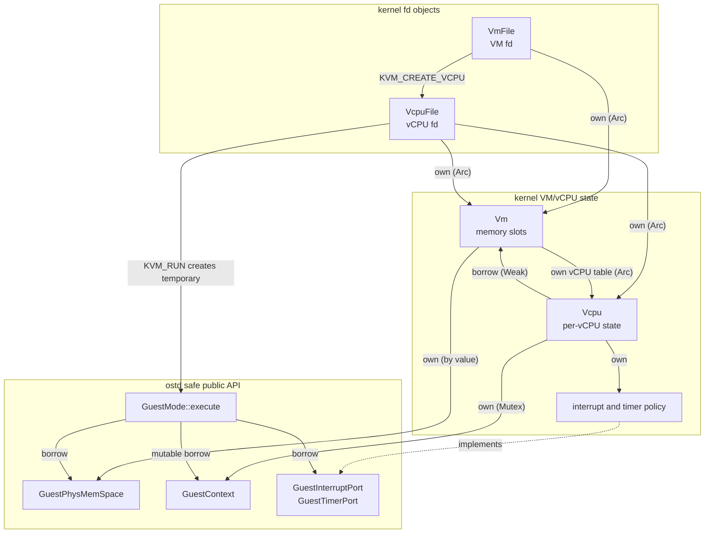

# RFC-0003: Hypervisor Support

* Status: Draft
* Pull request: https://github.com/asterinas/asterinas/pull/3418
* Date submitted: 2026-06-21
* Date approved: YYYY-MM-DD

## Summary

This RFC proposes extending OSTD with hypervisor support. These OSTD facilities allow `kernel/` to safely implement a complete hypervisor, including a KVM-compatible control plane, while keeping privileged virtualization mechanisms inside OSTD.

## Motivation

Asterinas needs virtualization support for existing Linux KVM-based VMMs and unmodified guest kernels.

Supporting virtualization requires extending the framekernel boundary with care. Taking x86 as an example, a malformed VMCS, a bad EPT mapping, or an incorrectly restored host register can break the soundness semantics of the host kernel. Therefore, this RFC focuses on what kind of OSTD hypervisor layer Asterinas needs: it must provide soundness by encapsulating privileged virtualization mechanisms, minimality by keeping the trusted surface small, and expressiveness by giving `kernel/` enough safe operations to build a complete hypervisor above it.

## Design

### Layering

This split of the virtualization mechanism and the policy mirrors the existing user-mode design in Asterinas. The kernel can decide what to run and how to handle exits, but the transition that could affect host CPU state is mediated by OSTD.

The Asterinas kernel owns the KVM-compatible file-descriptor ABI and kernel policy. It implements `/dev/kvm`, VM file descriptors, vCPU file descriptors, the `kvm_run` shared page, memory-slot registration, register ioctls, basic in-kernel irqchip emulation, and conversion between KVM structs and OSTD types.

OSTD owns the virtualization mechanism. It manages hardware virtualization state, second-stage address translation, and guest-host context switching, and returns `GuestRunResult` events to the kernel. The VM-exit case carries a small `GuestExitInfo` record.

### OSTD Interface Design

OSTD provides three new abstractions. `GuestPhysMemSpace` represents guest physical memory and owns second-stage translation from guest physical addresses to host frames. `GuestContext` represents the per-vCPU architectural state that must survive across guest exits. `GuestMode` is the execution object that enters guest mode, handles the guest-host state transition, and returns exits to the kernel.

The following diagram shows the core object ownership and the upper-lower relationship between the kernel hypervisor layer and the OSTD VM API.



#### GuestPhysMemSpace

`GuestPhysMemSpace` represents a guest physical address space backed by a second-stage translation page table.

Its public interface is similar to `VmSpace`, which exposes the cursor to operate on the page table:

```rust
// ostd/src/vm/gpm_space.rs

/// Manages the guest physical memory space of a VM.
///
/// This type owns the page table that maps guest physical addresses to
/// host physical frames. One `GuestPhysMemSpace` can be reused by multiple
/// vCPUs in the same VM by passing a reference to
/// [`super::GuestMode::execute`].
pub struct GuestPhysMemSpace;

impl GuestPhysMemSpace {
    /// Creates a new guest physical memory space.
    pub fn new() -> Result<Self>;

    /// Gets an immutable cursor over a guest physical address range.
    pub fn cursor<'a, G: AsAtomicModeGuard>(
        &'a self,
        guard: &'a G,
        gpa: &Range<Gpaddr>,
    ) -> Result<Cursor<'a>>;

    /// Gets a mutable cursor over a guest physical address range.
    pub fn cursor_mut<'a, G: AsAtomicModeGuard>(
        &'a self,
        guard: &'a G,
        gpa: &Range<Gpaddr>,
    ) -> Result<CursorMut<'a>>;
}

/// The cursor for querying over the guest physical memory space without modifying it.
pub struct Cursor<'a>;

impl Cursor<'_> {
    /// Gets the guest physical address of the current slot.
    pub fn gpa(&self) -> Gpaddr;

    // Query and navigation interfaces are the same as `vm_space::Cursor`.
    // ...
}

/// The cursor for modifying the mappings in guest physical memory space.
pub struct CursorMut<'a>;

impl<'a> CursorMut<'a> {
    /// Gets the guest physical address of the current slot.
    pub fn gpa(&self) -> Gpaddr;

    // Query, navigation, map, and unmap interfaces are the same as `vm_space::Cursor`.
    // ...
}
```

**Soundness, minimality and expressiveness.**

Since the key interfaces provided by `GuestPhysMemSpace` are exactly the same as those of `VmSpace`, they can also ensure soundness, minimality, and expressiveness.

#### GuestContext

`GuestContext` is the per-vCPU state object. It stores the guest-visible register state, the vCPU run state, and the hardware virtualization owned by OSTD.

Its public interface is (using the x86 architecture as an example):

```rust
// ostd/src/arch/x86/vm/context.rs

/// Stores the execution context and run state of a guest vCPU.
///
/// The kernel uses it to configure the vCPU-visible context, including
/// general-purpose registers, special registers, MSRs, and CPUID leaves.
///
/// OSTD uses it to emulate guest instructions and to provide
/// [`crate::vm::GuestMode`] with the state needed to run the vCPU. Before
/// entering the vCPU, `GuestMode` loads the context into hardware. After a
/// VM exit, `GuestMode` synchronizes the hardware vCPU state back into this
/// context.
pub struct GuestContext;

impl GuestContext {
    /// Creates a guest vCPU context.
    ///
    /// Returns an error if the VMX virtualization environment is not ready.
    pub fn new(id: u32) -> Result<Self>;

    /// Returns the guest general-purpose register state.
    pub fn regs(&self) -> VcpuRegs;

    /// Replaces the guest general-purpose register state.
    pub fn set_regs(&mut self, regs: VcpuRegs);

    // `GuestContext` provides numerous get/set APIs for the guest vCPU state.
    // The accessible guest vCPU state includes general-purpose registers,
    // system registers, model-specific registers, and vCPU state, among others.
    // The interface format is similar to the above `regs` and `set_regs`,
    // and the types such as `VcpuRegs` used in the interface are also made public
    // to the kernel.
    // ...
}

/// Guest general-purpose registers.
///
/// This structure represents the guest CPU's general-purpose registers.
#[repr(C)]
#[derive(Clone, Copy, Debug, Default, Pod)]
pub struct VcpuRegs {
    pub rax: u64,
    pub rbx: u64,
    pub rcx: u64,
    pub rdx: u64,
    pub rsi: u64,
    pub rdi: u64,
    pub rbp: u64,
    pub rsp: u64,
    pub r8: u64,
    pub r9: u64,
    pub r10: u64,
    pub r11: u64,
    pub r12: u64,
    pub r13: u64,
    pub r14: u64,
    pub r15: u64,
    pub rip: u64,
    pub rflags: u64,
}

// More structures for the guest vCPU state.
// ...
```

**Soundness.**

`GuestContext` merely wraps the vCPU state and provides interfaces for reading and setting the vCPU state. Through these interfaces, it does not affect the host state, nor does it impact the memory safety of the host kernel.

**Minimality.**

`GuestContext` centralizes the vCPU data that OSTD must understand when switching into guest mode. To the kernel, it is a minimal vCPU state interface for configuring and running a guest. Additional device-level vCPU state, such as irqchip state, remains in the kernel or userspace VMM layer.

**Expressiveness.**

`GuestContext` exposes enough interfaces for the kernel to configure key guest registers such as general-purpose registers, system registers and so on. This lets the kernel build vCPUs in various states, and update guest state while emulating exits such as MMIO accesses.

#### GuestMode

`GuestMode` is the OSTD execution object that performs VM entry and returns VM exits. The public interfaces are:

````rust
// ostd/src/vm/mod.rs

/// Runs guest vCPU code in an isolated guest execution mode.
///
/// `GuestMode` is the OSTD-side execution object for a guest vCPU. It enters
/// guest execution with the vCPU context and kernel-provided policy ports
/// supplied to [`Self::execute`] until a VM exit must be handled outside OSTD.
///
/// Here is a sample code on how to use `GuestMode`.
///
/// ```no_run
/// use ostd::{
///     arch::vm::GuestContext,
///     prelude::*,
///     vm::{GuestInterruptPort, GuestMode, GuestPhysMemSpace, GuestTimerPort},
/// };
///
/// fn run_guest(
///     context: &mut GuestContext,
///     interrupt_port: &dyn GuestInterruptPort,
///     timer_port: &dyn GuestTimerPort,
///     guest_mem: &GuestPhysMemSpace,
/// ) -> Result<()> {
///     let mut guest_mode = GuestMode::new()?;
///
///     loop {
///         let _run_result = guest_mode.execute(context, guest_mem, interrupt_port, timer_port)?;
///         // Handle VM exit.
///     }
/// }
/// ```
pub struct GuestMode;

/// Describes why a guest run returned to the kernel client.
pub enum GuestRunResult {
    /// The vCPU exited and needs higher-level handling.
    VmExit(GuestExitInfo),
    /// The vCPU is waiting for a startup IPI and was not entered (x86 only).
    #[cfg(target_arch = "x86_64")]
    WaitForSipi,
}

impl GuestMode {
    /// Creates a guest execution object.
    ///
    /// Creating this value does not enter the guest; use [`Self::execute`] to
    /// run the vCPU with a guest context and kernel-provided policy ports.
    ///
    /// # Errors
    ///
    /// Returns an error if the platform does not support virtualization.
    pub fn new() -> Result<Self>;

    /// Runs the guest with the supplied
    /// guest context and guest physical memory space.
    ///
    /// The `interrupt_port` and `timer_port` arguments provide kernel
    /// policy for pending guest interrupts and guest timers
    /// while the vCPU is running.
    ///
    /// The method returns when guest execution needs handling by the kernel
    /// client. [`GuestRunResult::VmExit`] carries the architecture-specific
    /// VM-exit information.
    ///
    /// After handling the returned event and updating `context` or the guest
    /// device model as needed, call this method again to resume guest
    /// execution.
    pub fn execute<I, T>(
        &mut self,
        context: &mut GuestContext,
        guest_mem: &GuestPhysMemSpace,
        interrupt_port: &I,
        timer_port: &T,
    ) -> Result<GuestRunResult>
    where
        I: GuestInterruptPort + ?Sized,
        T: GuestTimerPort + ?Sized;
}

// ostd/src/vm/interrupt.rs

use crate::arch::vm::GuestInterrupt;

/// Provides guest interrupt injection policy to [`super::GuestMode`].
///
/// `GuestMode` uses this port before guest entry to choose whether a pending
/// interrupt should be injected into the guest. If it commits an interrupt for
/// the next entry, it calls [`GuestInterruptPort::accept_interrupt`] so the
/// kernel-side interrupt model can synchronize its state.
///
/// The implementation is supplied by the kernel. It may model a virtual
/// interrupt controller, or it may be a policy object that never offers
/// interrupts.
///
/// These methods may be called while guest entry preparation has disabled
/// preemption or local interrupts. Implementations must not sleep, yield, or
/// wait on synchronization primitives that can block the current task.
pub trait GuestInterruptPort {
    /// Returns the next guest interrupt to offer for injection.
    ///
    /// This method is a query. It should not consume the interrupt because
    /// `GuestMode` may find that the guest cannot accept it yet.
    /// Returning `None` means that no interrupt should be offered for this
    /// guest entry.
    ///
    /// An implementation that does not inject guest interrupts can always
    /// return `None`.
    fn check_pending_interrupt(&self) -> Option<GuestInterrupt>;

    /// Marks a guest interrupt as accepted for injection.
    ///
    /// `GuestMode` calls this method only after it has committed the interrupt
    /// for the next guest entry. Implementations should update their state
    /// accordingly.
    fn accept_interrupt(&self, interrupt: GuestInterrupt);
}

// ostd/src/vm/timer.rs

use crate::arch::vm::GuestTimerInstant;

/// Provides guest timer interrupt policy to [`super::GuestMode`].
///
/// `GuestMode` uses this port before VM entry to ask when a VM exit should
/// happen so the kernel can publish a virtual timer interrupt in time.
///
/// This method may be called while guest entry preparation has disabled
/// preemption or local interrupts. Implementations must not sleep, yield, or
/// wait on synchronization primitives that can block the current task.
pub trait GuestTimerPort {
    /// Returns the next guest timer deadline after `current`.
    ///
    /// The `current` argument is the current guest-visible timer instant. The
    /// returned deadline is expressed on the same guest-visible timeline.
    ///
    /// Returning `Some(deadline)` asks OSTD to arrange a guest exit when that
    /// deadline is reached.
    fn poll_deadline(&self, current: GuestTimerInstant) -> Option<GuestTimerInstant>;
}

// ostd/src/arch/x86/vm/exit/mod.rs

/// Describes a VM exit that should be handled outside OSTD.
pub struct GuestExitInfo {
    /// The VMX exit reason.
    pub exit_reason: u32,
    /// The length of the instruction that caused the exit.
    pub instruction_len: u32,
    /// VMX exit qualification.
    pub exit_qualification: u64,
    /// Guest physical address associated with the exit, if any.
    pub guest_phys_addr: Gpaddr,
    /// Guest instruction pointer at the exit.
    pub guest_rip: Gpaddr,
}
````

**Soundness.**

`GuestMode::execute` wraps the hardware virtualization transition and the sensitive CPU-state updates around it. After guest state is loaded and before host state is restored, OSTD prevents the run from migrating away from the current physical CPU or being interleaved with ordinary kernel execution. The kernel receives only `GuestRunResult`, whose VM-exit case carries `GuestExitInfo`; it cannot directly issue hardware virtualization instructions, or corrupt host state through this API.

The interrupt and timer ports are safe policy traits. A buggy kernel-side implementation may inject the wrong virtual interrupt or choose a poor timer deadline, but this can only affect guest behavior or latency. It must not corrupt host CPU state or host memory.

**Minimality.**

The type is deliberately small. It does not own the vCPU context, guest memory, or policy ports; those are supplied to each `execute` call. The kernel decides what interrupt or timer model to provide, but OSTD decides how and when those policy decisions are reflected in hardware.

**Expressiveness.**

`GuestMode` performs hardware virtualization operations according to the contents of `GuestContext`, so its expressiveness mostly follows from the expressiveness of `GuestContext` described above. It adds two ports for interrupt and timer state, which are intentionally kept out of `GuestContext`. Together, the context and ports let the kernel run a guest while providing virtual interrupts and timer events. `GuestRunResult` also gives the kernel a direct way to handle other exit conditions besides VM exit.

#### VMX and VMCS Lifecycle on x86

The `GuestMode` and `GuestContext` APIs make it possible to manage the VMX and VMCS lifecycles safely and efficiently. One possible implementation ties VMXON state to the lifetime of `GuestMode`. Following [Linux's approach](https://github.com/torvalds/linux/blob/master/arch/x86/kvm/vmx/vmx.c), statically allocated per-CPU data records which VMCSs are active and which VMCS is current. This design promptly clears any residual VMCS state when a VMCS migrates between CPUs or VMX operation is disabled, serializes VMXOFF against `GuestMode::execute`, and, when a VMCS does not migrate, makes effective use of the CPU's VMCS cache for good performance. These details are encapsulated by the OSTD APIs: the kernel neither needs to manage them nor can use them to perform unsafe operations.

### Building a Hypervisor With the OSTD APIs

The kernel can build a complete hypervisor by composing the OSTD objects above with kernel-owned policy and device state. A minimal Rust-like pseudo-code flow looks like this:

```rust
fn create_and_run_guest(image: GuestImage, userspace_mem: UserRange) -> Result<()> {
    // Create the VM and install userspace-backed guest RAM into the GPA space.
    let guest_mem = GuestPhysMemSpace::new();
    let frames: Vec<UFrame> = query_userspace_frames(&userspace_mem)?;
    let guest_range = image.ram_gpa..image.ram_gpa + userspace_mem.len;
    let preempt_guard = disable_preempt();
    let mut cursor = guest_mem.cursor_mut(&preempt_guard, &guest_range)?;
    for frame in &frames {
        cursor.map(frame.clone(), guest_mem_prop());
    }
    drop(cursor);
    record_memory_slot(0, &userspace_mem, guest_range, frames)?;

    // Create a vCPU context and let the kernel choose the guest boot state.
    let mut context = GuestContext::new(0)?;
    context.set_regs(image.boot_regs());
    context.set_sregs(image.boot_sregs());

    // Kernel-owned policy ports provide virtual interrupts and timers.
    let lapic = KernelLapicPort::new();
    let mut guest_mode = GuestMode::new();

    loop {
        match guest_mode.execute(&mut context, &guest_mem, &lapic, &lapic)? {
            GuestRunResult::WaitForSipi => wait_for_startup_ipi()?,
            GuestRunResult::VmExit(exit) => match decode_exit(exit) {
                Exit::Mmio(access) => emulate_mmio(access)?,
                Exit::Io(access) => forward_to_userspace_vmm(access)?,
                Exit::Hlt | Exit::Shutdown => return Ok(()),
                Exit::Other(exit) => reflect_exit_to_userspace(exit)?,
            },
        }
    }
}
```

This example shows the intended split. OSTD owns the mechanisms needed to enter and leave guest mode safely. The kernel owns VM lifecycle, memory-slot policy, vCPU file semantics, interrupt-chip state, device emulation, and userspace handoff.

### Architecture-agnostic Design

The current API split should be able to support ARM and RISC-V.

`GuestMode` and `GuestPhysMemSpace` are intended to be architecture-agnostic APIs. `GuestTimerPort` and `GuestInterruptPort` should also be architecture-agnostic.

`GuestContext` and `GuestExitInfo` are intentionally architecture-specific. It is both reasonable and necessary to provide one `GuestContext` API and one `GuestExitInfo` type per architecture, since register state, system registers, exit reasons, and exit metadata are fundamentally different across x86, ARM, and RISC-V.

The hypervisor implementation model exposed by the OSTD APIs is reusable for ARM and RISC-V. Both architectures provide hardware-assisted second-stage translation. `GuestPhysMemSpace` is exactly the abstraction for that second stage page table: it provides generic mapping, unmapping, and query operations, while the internal implementation can use different `PageTableConfig`s for x86 [EPT](https://www.intel.com/content/www/us/en/developer/articles/technical/intel-sdm.html "Vol. 3C. 30.3 EPT"), ARM [stage-2 translation](https://developer.arm.com/documentation/102142/0100/Stage-2-translation), or [RISC-V G-stage translation](https://docs.riscv.org/reference/isa/v20260120/priv/hypervisor.html#two-stage-translation).

`GuestMode` also maps naturally to ARM and RISC-V. All three architectures need an OSTD-controlled path that saves host state, loads guest vCPU state, installs the guest physical memory space, enters the guest execution environment, and returns to the kernel on a guest exit.

The two port traits express policy rather than hardware details. `GuestInterruptPort` provides guest interrupt injection policy to `GuestMode::execute`. On x86, the port may be backed by virtual [APIC](https://wiki.osdev.org/APIC) state; on ARM, by virtual [GIC](https://developer.arm.com/documentation/198123/0302/What-is-a-Generic-Interrupt-Controller-) state; and on RISC-V, by virtual interrupt-controller state such as a virtual [PLIC](https://wiki.osdev.org/PLIC) or virtual [AIA interrupt-controller](https://docs.riscv.org/reference/aia/v1.0/intro.html) state. `GuestTimerPort` provides guest timer interrupt policy to `GuestMode::execute`. On x86, the port may be backed by virtual [APIC timer or TSC-deadline timer](https://www.intel.com/content/www/us/en/developer/articles/technical/intel-sdm.html "Vol. 3A. 12.5.4 APIC Timer") state; on ARM, by [generic timer](https://developer.arm.com/documentation/ddi0487/mb/-Part-D-The-AArch64-System-Level-Architecture/-Chapter-D12-The-Generic-Timer-in-AArch64-state/-D12-1-About-the-Generic-Timer/-D12-1-1-The-full-set-of-Generic-Timer-components?lang=en); and on RISC-V, by virtual timer state exposed through an [SBI timer interface](https://docs.riscv.org/reference/sbi/v3.0/ext-time.html) or the [Sstc](https://docs.riscv.org/reference/isa/v20260120/priv/sstc.html) virtual-supervisor timer facility.

## Drawbacks, Alternatives, and Unknowns

### Unresolved Questions

* Is the current OSTD hypervisor interface stable enough for future acceleration features such as vAPIC acceleration? If those features require exposing additional VMCS controls, interrupt virtualization state, or APIC backing pages, the `GuestContext`, `GuestMode`, and `GuestPhysMemSpace` boundaries may need to evolve.

## Prior Art and References

* [Asterinas OSTD soundness analysis](../ostd/soundness/README.md)
* [Linux KVM API documentation](https://www.kernel.org/doc/html/latest/virt/kvm/api.html)
* [Intel 64 and IA-32 Architectures Software Developer Manuals](https://www.intel.com/content/www/us/en/developer/articles/technical/intel-sdm.html)
