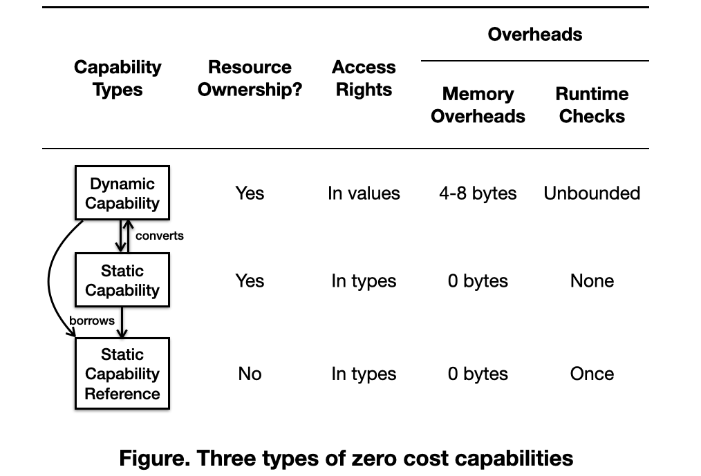

# Zero-Cost Capabilities

To strengthen the security of Asterinas, we aim to implement all kinds of OS resources
as capabilities. As the capabilities are going to be used throughout the OS,
it is highly desirable to minimize their costs. For this purpose,
we want to implement capabilities as a _zero-cost abstraction_.
Zero cost abstractions, as initially proposed and defined by C++'s creator,
are required to satisfy two criteria:
* What you don’t use, you don’t pay for;
* What you do use, you couldn’t hand code any better.

## Traditional capabilities are not zero-cost abstractions

Capabilities, when implemented straightforwardly, are not zero-cost
abstractions. Take the following code snippet as an example,
which attempts to implement an RPC primitive named `Channel<T>` as a capability.

```rust
pub struct Channel<T> {
    buf: Arc<Mutex<VecDeque<T>>,
    rights: Rights,
}

impl<T> Channel<T> {
    pub fn new() {
        Self {
            buf: Arc::new(Mutex::new(VecDeque::new())),
            rights: Rights::READ | Rights::WRITE | Rights::DUP,
        }
    }

    pub fn push(&self, item: T) -> Result<()> {
        if !self.rights.contains(Rights::WRITE) {
            return Err(EACCESS);
        }
        self.buf.lock().push(item);
        Ok(())
    }

    pub fn pop(&self) -> Result<T> {
        if !self.rights.contains(Rights::READ) {
            return Err(EACCESS);
        }
        self.buf.lock()
            .pop()
            .ok_or(EAGAIN)
    }

    pub fn dup(&self) -> Result<Self> {
        if !self.rights.contains(Rights::DUP) {
            return Err(EACCESS);
        }
        let dup = Self {
            buf: self.buf.clone(),
            rights: self.rights,
        };
        Ok(dup)
    }

    pub fn restrict(mut self, right_mask: Rights) -> Self {
        let Self { buf, rights } = self;
        let rights = rights & right_mask;
        Self { buf, rights }
    }
}
```

Such an implementation violates the two criteria for zero-cost abstractions.
To see why, let's consider a user would use `Channel<T>` to implement `Pipe` 
(like UNIX pipes).

```rust
pub fn pipe() -> (PipeWriter, PipeReader) {
    let channel = Channel::new();
    let writer = {
        let writer_channel = channel
            .dup()
            .unwrap()
            .restrict(Rights::WRITE);
        PipeWriter(writer_channel)
    };
    let reader = {
        let reader_channel = channel
            .dup()
            .unwrap()
            .restrict(Rights::READ);
        PipeWriter(reader_channel)
    };
    (writer, reader)
}

pub struct PipeWriter(
    // Actually, we know for sure that the channel is write-only. 
    // No need to keep permissions inside the channel!
    // But the abstraction prevents us from trimming the needless information.
    Channel<u8>
);

pub struct PipeReader(
    // Same problem as above!
    Channel<u8>
);

impl PipeWriter {
    pub fn write(&self, buf: &[u8]) -> Result<usize> {
        for byte in buf {
            // Again, we know for sure that the channel is writable.
            // So there is no need to check it every time.
            // But the abstraction prevents us from avoiding the unnecessary check.
            self.0.push(byte);
        }
        Ok(buf.len())
    }
}

impl PipeReader {
    pub fn read(&self, buf: &mut [u8]) -> Result<usize> {
        let mut nbytes_read = 0;
        // Same problem as above!
        while let Ok(byte) = self.0.pop() {
            buf[nbytes_read] = byte;
            nbytes_read += 1;
        }
        if nbytes_read > 0 {
            Ok(nbytes_read)
        } else {
            Err(EAGAIN)
        }
    }
}
```

As you can see, the abstraction of `Channel<T>` introduces extra costs,
which would not exist if the same code is written manually instead of 
using the abstraction of `Channel<T>`. So a channel capability is not a
zero-cost abstraction.

## The three types of zero-cost capabilities

Our secret sauce for achieving zero-cost capabilities is based on two observations.
1. The access rights may be encoded in types and access rights 
can be checked at compile time with some type-level programming tricks. This way,
the memory footprint for representing access rights would become zero and the
runtime check can also be avoided.
1. There could be different forms of capabilities, each covering a different 
usage pattern with minimal overheads. Under such arrangement, 
the access rights would be represented in types if the situation permits. 
Otherwise, they would be encoded in values.

With the two observations, we introduce three types of zero-cost capabilities.

* **Dynamic capabilities.** Dynamic capabilities keep access rights in values 
like the traditional capabilities shown in the example above. This is the 
most flexible one among the three, but it incurs 4-8 bytes of memory footprint
for storing the access rights and must check the access rights at runtime.
* **Static capabilities.**  Static capabilities encode access rights in types.
As the access rights can be determined at the compile time, there is zero 
overheads incurred. Static capabilities are useful when the access rights 
are known when coding.
* **Static capability references.** A static capability reference is a reference
to a dynamic or static capability plus the associated access rights encoded in types.
A static capability reference may be borrowed from a dynamic capability safely
after checking the access rights. Once the static capability reference is obtained,
it can be used freely without any runtime checks. This enables check-once-use-multiple-times.
Borrowing a static capability reference from a static capability incurs
zero runtime overhead.

The three types of capabilities are summarized in the figure below.



## Encoding access rights in types

Static capabilities depend on the ability to encode access rights in types.
This section shows how this can be done with type-level programming tricks.

### Introducing the typeflags crate


```rust
//! Type-level flags.
//!
//! The `typeflags` crate can be seen as a type-level implementation
//! of the popular `bitflags` crate.
//!
//! ```rust
//! bitflags! {
//!     pub struct Rights: u32 {
//!         const READ   = 1 << 0;
//!         const WRITE  = 1 << 1;
//!     }
//! } 
//! ```
//!
//! The `bitflags` macro generates a struct named `Rights` that 
//! has two associated constant values, `Rights::READ` and `Rights::WRITE`,
//! and provides a bunch of methods to operate on the bit flags.
//!
//! The `typeflags` crate provides a macro that adopts a similar syntax.
//! The macro also generates code to represent flags but at the type level.
//!
//! ```rust
//! typeflags! {
//!     pub trait RightSet: u32 {
//!         struct READ   = 1 << 0;
//!         struct WRITE  = 1 << 1;
//!     }
//! } 
//! ```
//!
//! The code above generates, among other things, the `RightSet` trait, 
//! the `Read` and `Write` structs (which implements the trait), and 
//! a macro to construct a type that represents any specified combination
//! of `Read` and `Write` structs.
//!
//! For more example on the usage, see the unit tests.

/// Generate the code that implements a specified set of type-level flags.
macro_rules! typeflags {
    // A toy implementation for the purpose of demonstration only.
    //
    // The implementation is toy because it hardcodes the input and output.
    // What's more important is that it suffers two key limitations.
    //
    // 1. It has a complexity of O(4^N), where N is the number of bits. In
    // this example, N equals to 2. Using type-level programming tricks can
    // reduce the complexity to O(N^2), or even O(N).
    //
    // 2. A declarative macro is not allowed to output another declarative macro. 
    // I suppose that a procedural macro should be able to do that. If so,
    // implementing typeflags as a procedural macro should do the job.
    // Otherwise, we need to figure out a way to workaround the limitation.
    (
        // Hardcode the input
        trait RightSet: u32 {
            struct Read  = 1 << 0;
            struct Write = 1 << 1;
        }
    ) => {
        // Hardcode the output

        pub trait RightSet {
            const BITS: u32;

            fn new() -> Self;
        }

        pub struct Empty {}
        pub struct Read {}
        pub struct Write {}
        pub struct ReadWrite {}
        
        impl RightSet for Empty {
            const BITS: u32 = 0b00;

            fn new() -> Self { Self {} }
        }
        impl RightSet for Read {
            const BITS: u32 = 0b01; 

            fn new() -> Self { Self {} }
        }
        impl RightSet for Write {
            const BITS: u32 = 0b10;

            fn new() -> Self { Self {} }
        }
        impl RightSet for ReadWrite {
            const BITS: u32 = 0b11;

            fn new() -> Self { Self {} }
        }

        pub trait RightSetContains<S> {}

        impl RightSetContains<Empty> for Empty {}
        impl RightSetContains<Empty> for Read {}
        impl RightSetContains<Read> for Read {}
        impl RightSetContains<Empty> for Write {}
        impl RightSetContains<Write> for Write {}
        impl RightSetContains<Empty> for ReadWrite {}
        impl RightSetContains<Read> for ReadWrite {}
        impl RightSetContains<Write> for ReadWrite {}
        impl RightSetContains<ReadWrite> for ReadWrite {}

        // This macro help construct an arbitrary type flags
        macro_rules! RightSet {
            () => { Empty }
            (Read) => { Read }
            (Write) => { Write }
            (Read, Write) => { ReadWrite }
            (Write, Read) => { ReadWrite }
        }
    }
}

mod test {
    use super::*;

    typeflags! {
        trait RightSet: u32 {
            struct Read  = 1 << 0;
            struct Write = 1 << 1;
        }
    }

    // Test that the type flags can be constructed through a
    // generated macro named RightSet.
    type O = RightSet![];
    type R = RightSet![Read];
    type W = RightSet![Write];
    type RW = RightSet![Read, Write];

    #[test]
    fn new() {
        let _o = O::new();
        let _r = R::new();
        let _w = W::new();
        let _rw = RW::new();
    }

    #[test]
    fn to_u32() {
        const R_BITS: u32 =  0b00000001;
        const W_BITS: u32 = 0b00000010;
        
        assert!(O::BITS == 0);
        assert!(R::BITS == R_BITS);
        assert!(W::BITS == W_BITS);
        assert!(RW::BITS == R_BITS | W_BITS);
    }

    #[test]
    fn contains() {
        assert_trait_bound!(O: RightSetContains<O>);
        assert_trait_bound!(R: RightSetContains<O>);
        assert_trait_bound!(W: RightSetContains<O>);
        assert_trait_bound!(RW: RightSetContains<O>);

        assert_trait_bound!(R: RightSetContains<R>);
        assert_trait_bound!(RW: RightSetContains<R>);

        assert_trait_bound!(W: RightSetContains<W>);
        assert_trait_bound!(RW: RightSetContains<W>);
    
        assert_trait_bound!(RW: RightSetContains<RW>);
    }
}
```

### Implement access rights with typeflags

The `aster-rights/lib.rs` file implements access rights.

```rust
//! Access rights.

use typeflags::typeflags;
use bitflags::bitflags;

bitflags! {
    pub struct Rights: u32 {
        const READ  = 1 << 0;
        const WRITE = 1 << 1;
        const DUP   = 1 << 2;
    }
}

typeflags! {
    pub trait RightSet: u32 {
        struct Read  = 1 << 0;
        struct Write = 1 << 1;
        struct Dup   = 1 << 2;
    }
}
```

The `aster-rights-proc/lib.rs` file implements the `require` procedural macro.
See the channel capability example later for how `require` is used.

```rust
#[proc_macro_attribute]
pub fn require(_attr: TokenStream, _item: TokenStream) -> TokenStream {
    todo!()
}
```

## Example: zero-cost channel capabilities

This example shows how the three types of capabilities can be implemented
for channels.

* Dynamic capabilities: `Channel<Rights>`
* Static capabilities: `Channel<R: RightSet>`
* Static capability references: `ChannelRef<'a, R: RightSet>`

```rust
pub struct Channel<R = Rights>(Arc<ChannelInner>, R);

impl<R> Channel<R> {
    pub fn new(rights: R) -> Self {
        Self(ChannelInner::new(), rights)
    }
}

struct ChannelInner {
    buf: Mutex<VecDeque<T>,
}

impl ChannelInner {
    pub fn new() -> Self {
        Self {
            buf: Mutex::new(VecDeque::new()),
        }
    }

    pub fn push(&self, item: T) {
        self.buf.lock().push(item);
    }

    pub fn pop(&self) -> Option<T> {
        self.buf.lock().pop()
    }
}

impl Channel<Rights> {
    pub fn push(&self, item: T) -> Result<()> {
        if !self.rights().contains(Rights::WRITE) {
            return Err(EACCESS);
        }
        self.0.push(item);
        Ok(())
    }

    pub fn pop(&self) -> Result<T> {
        if !self.rights.contains(Rights::READ) {
            return Err(EACCESS);
        }
        self.0.pop()
            .ok_or(EAGAIN)
    }

    pub fn dup(&self) -> Result<Self> {
        if !self.rights.contains(Rights::DUP) {
            return Err(EACCESS);
        }
        let dup = Self {
            buf: self.0.clone(),
            rights: self.rights,
        };
        Ok(dup)
    }

    pub fn rights(&self) -> Rights {
        self.rights
    }

    pub fn restrict(mut self, right_mask: Rights) -> Self {
        let new_rights = self.rights() & right_mask;
        self.1 = new_rights;
        self
    }

    pub fn to_static<R>(mut self) -> Result<Channel<R>>
    where
        R: RightSet,
    {
        let Self (inner, rights) = self;
        if !rights.contains(R::BITS) {
            return Err(EACCESS);
        }
        let static_self = Channel(inner, R::new());
        Ok(static_self)
    }

    pub fn to_ref<R>(&self) -> Result<ChannelRef<'_, R>>
    where
        R: RightSet,
    {
        if !self.rights().contains(R::BITS) {
            return Err(EACCESS);
        }
        Ok(ChannelRef(self, PhantomData))
    }
}

impl<R: RightSet> Channel<R> {
    #[require(R > Write)]
    pub fn push(&self, item: T) {
        self.0.push(item);
    }

    #[require(R > Read)]
    pub fn pop(&self) -> Option<T> {
        self.0.pop()
    }

    #[require(R > DUP)]
    pub fn dup(&self) -> Self {
        Self(self.0.clone(), self.rights)
    }

    pub fn rights(&self) -> Rights {
        R::BITS
    }

    #[require(R > R1)]
    pub fn restrict<R1>(mut self) -> Channel<R1> {
        let Self (inner, _) = self;
        Channel(inner, PhantomData)
    }

    pub fn to_dyn(mut self) -> Channel<Rights>
    {
        let Self (inner, _) = self;
        let dyn_self = Channel(inner, R::BITS);
        dyn_self
    }

    #[require(R > R1)]
    pub fn to_ref<R1>(&self) -> ChannelRef<'_, R1> {
        ChannelRef(self, PhantomData)
    }
}

pub struct ChannelRef<'a, R: RightSet>(&'a Arc<ChannelInner>, PhantomData<R>);

impl<'a, R: RightSet> ChannelRef<'a, R> {
    #[require(R > Write)]
    pub fn push(&self, item: T) {
        self.0.push(item);
    }

    #[require(R > Read)]
    pub fn pop(&self) -> Option<T> {
        self.0.pop()
    }

    pub fn rights(&self) -> Rights {
        R::BITS
    }

    #[require(R > R1)]
    pub fn restrict<R1>(mut self) -> ChannelRef<R1> {
        let Self (inner, _) = self;
        ChannelRef(inner, PhantomData)
    }
}
```

So what does code look like after the magical `require` macro expands?
Let's take `ChannelRef::restrict` as an example. After macro expansion,
the code looks like the below.

```rust
impl<'a, R: RightSet> ChannelRef<'a, R> {
    pub fn restrict<R1>(mut self) -> ChannelRef<R1>
    where
        R: RightSetContains<R1>
    {
        let Self (inner, _) = self;
        ChannelRef(inner, PhantomData)
    }
}
```
