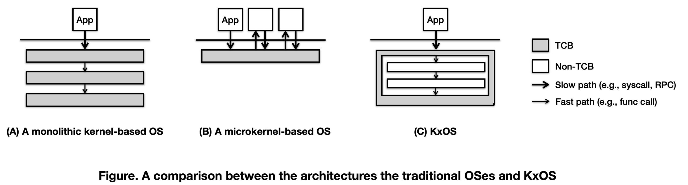

# Privilege Separation

One fundamental design goal of Asterinas is to support _privilege separation_, i.e., the separation between the privileged OS core and the unprivileged OS components. The privileged portion is allowed to use `unsafe` keyword to carry out dangerous tasks like accessing CPU registers, manipulating stack frames, and doing MMIO or PIO. In contrast, the unprivileged portion, which forms the majority of the OS, must be free from `unsafe` code. With privilege separation, the memory safety of Asterinas can be boiled down to the correctness of the privileged OS core, regardless of the correctness of the unprivileged OS components, thus reducing the size of TCB  significantly.

To put privilege separation into perspective, let's compare the architectures
of the monolithic kernels, microkernels, and Asterinas.

The diagram above highlights the characteristics of different OS architectures 
in terms of communication overheads and the TCB for memory safety.
Thanks to privilege separation, Asterinas promises the benefit of being _as safe as a microkernel and as fast as a monolithic kernel_.

Privilege separation is an interesting research problem, prompting us to 
answer a series of technical questions.

1. Is it possible to partition a Rust OS into the privileged and unprivileged halves? (If so, consider the following questions)
2. What are the safe APIs exposed by the privileged OS core?
3. Can OS drivers be implemented as unprivileged code with the help from the privileged OS?
4. How small can the privileged OS core be?

To answer these questions, we will make two case studies in the rest of this
chapter: one is [the common syscall workflow](syscall_workflow.md) and the other
is [the drivers for Virtio devices on PCI bus](pci_virtio_drivers.md). With the
two case studies, we can be confident to give a big YES for Q1 and Q3. And we
propose some key APIs of the privileged OS core, thus providing a partial answer
for Q2. We cannot give a precise answer to Q4 until the privileged OS core is
fully implemented. But the two case studies shall provide strong evidence that
the final TCB shall be much smaller than the size of the entire OS.